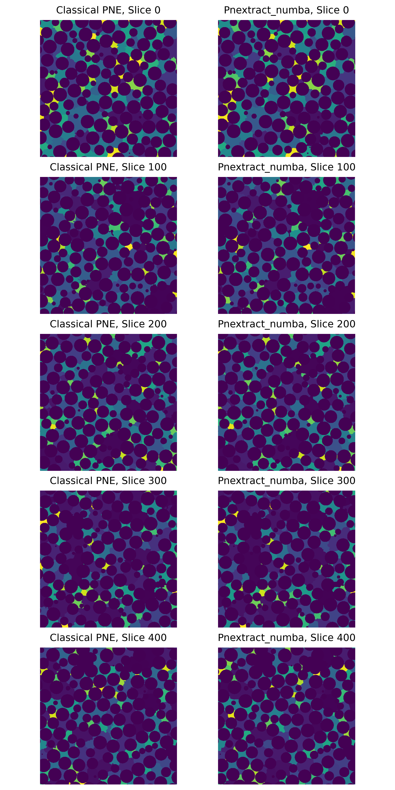

# Pore Network Segmentation (Pure Python Implementation)

This repository provides a pure Python implementation for **pore network segmentation** that approximates the behavior of the [**Classical Pore Network Extraction (PNE) method**](https://github.com/ImperialCollegeLondon/pnextract). I sincerely thank the [**Pore-Scale Modelling and Imaging Research Group**](https://www.imperial.ac.uk/earth-science/research/research-groups/pore-scale-modelling/) at Imperial College London for their meticulous research and for making their code openly available. Their dedication to pore-scale modelling and imaging has greatly facilitated this work.  

The focus of this module is on **robust, maintainable code** with performance acceleration via **Numba**, while remaining fully compatible with the Python scientific ecosystem.

> ⚠️ **Note**: This module performs **segmentation only**—it does **not** extract the network topology (e.g., pores, throats, connectivity). Network extraction will be added in future modules.

---
## 📌 Features

- Pure Python implementation with minimal dependencies  
- Approximates classical PNE segmentation logic  
- Uses an **envelope-based distance map** (slightly different from classical PNE)  
- Accelerated with **Numba JIT compilation** (near-C speed after warm-up)  
- Easy to inspect, modify, and integrate into Python workflows  

---
## 📦 Installation
Simply **download the `pnextract` folder** and **add it directly to your project directory**.

You need Python ≥ 3.9 Install the required dependencies:

```bash
pip install numba numpy
```

To reproduce the example results or run visualizations:

```bash
pip install matplotlib pypne
```

---
## 🛠 How to Use
```python
from pnextract import extract
from pathlib import Path
import numpy as np
import time

Path_img = Path(r"./image_500_500_500.npz")
img = np.load(Path_img)["arr_0"]

img_bool = img == 0
del img

t0 = time.time()
VElems = extract(img_bool)
print(f"time_cost:{time.time() - t0}")
num_pore = np.unique(VElems).size - 1
print("*" * 20)
print(f"num_pores:{num_pore}")
print("*" * 20)

VElems = VElems[1:-1, 1:-1, 1:-1]
'''
Show the first slice of VElems
'''
# import matplotlib.pyplot as plt
# plt.imshow(VElems[1])
# plt.show()
```

---
## 📊 Benchmark Results

We tested three configurations on the same input image(image_500_500_500.npz):

| Method                        | Threads | Num Pores | Time Cost (s) | Notes                 |
| ----------------------------- | ------- | --------- | ------------- | --------------------- |
| Classical PNE (Single Thread) | 1       | 1832      | 173.1 s       | Baseline              |
| Classical PNE (64 Threads)    | 64      | 1832      | 48.0 s        | Parallelized C++      |
| pnextract_numba (64 Threads)  | 64      | 1922      | 39.5s         | Python implementation |



To reproduce the benchmark results, download the `Data` folder and run the provided `classical_extract.py pnextract_numba_sample.py plot_res.py` scripts.

---
## 📜 License
This project is licensed under the `Apache License 2.0`. See the [LICENSE](LICENSE) file for details.

---